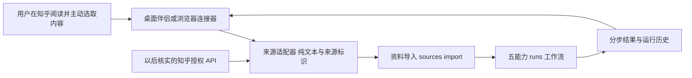

# 知乎与桌面伴侣后端适配设计

2026 年 9 月 8 日。本文件规定接入边界与开发顺序，不代表已接通知乎官方采集接口。

产品入口将是悬浮球或桌面伴侣。五项能力应复用同一个后端：桌面端只负责用户触发、取得用户选择的内容、提交请求和展示结果。阅读、问答、卡片、证据审查、知识图的逻辑及运行历史留在本地服务，避免未来更换桌面技术时重写核心能力。

## 先复用现有接口

图中的桌面伴侣、浏览器连接器和知乎授权 API 尚未实现。资料导入和五项独立能力已经存在；本轮新增持久运行接口，最终实现状态以开发结果记录为准。

| 场景 | 接口及数据 | 实施状态 |
| --- | --- | --- |
| 选取内容或导出 JSON 导入 | POST `/api/v1/sources/import`，返回 source_id | 已有后端；桌面采集器未实现 |
| 搜索已有资料 | GET `/api/v1/sources/search`，支持 q、author_id、offset、limit | 资料库开发线已实现 |
| 执行五项能力 | POST `/api/v1/runs`，包含 source_id、tasks、显式 question/claims | 本轮后端开发 |
| 查看历史与部分结果 | GET `/api/v1/runs` 和 `/api/v1/runs/{id}` | 本轮后端开发 |
| 请求取消和恢复 | POST `/api/v1/runs/{id}/cancel` 与 `/retry` | 本轮后端开发；步骤之间检查，不能强行撤销已发出的模型请求 |
| 卡片交付 | POST `/api/v1/cards/export/tsv` 或 `/apkg` | 已有后端 |

桌面端首先以选定资料为中心发起任务，用户明确提出问题和待审查主张，不能把原文所有句子默认当作事实审查主张。事实审查需要排除被审文章本身，证据范围应由后端固定在运行快照中。答主问答仍说明是依据资料生成，不能冒充知乎作者本人。

## 来源适配契约

当前 `SourceDraft` 可直接表达 title、author_id、author_name、text、url、topics 和 origin。输入必须是用户提供或可正常取得的内容；原文换行和空白应保留。模型负责理解与整理，适配器负责来源和文本，不应让模型凭空补作者、补链接或重建未取得的全文。

作者 ID 应使用稳定标识，不能仅把显示名作为唯一身份。未取得可信知乎作者标识时，应使用明确的本地临时 ID，并在后续元数据中区分；不能猜作者身份。来源 URL 是追溯信息，不能把写入 URL 等同于已抓取网页。

正式接入采集时建议新增独立 capture/provenance 元数据，保留 platform、external_content_id、content_type、canonical_url、capture_scope（全文或选段）、captured_at、external_updated_at、content_hash 和 adapter_version。当前 SourceDraft 不接受这些扩展字段，应先与资料库开发线约定迁移，不直接给现有请求塞入额外字段。

首次导入以原文内容哈希实现幂等；将来同步需要把外部内容 ID 与内部多个不可变版本关联。作者编辑文章时新增版本，已有运行继续引用旧版本；删除/撤回的来源需标明状态，不能悄悄改动历史引用。超过当前每篇 100,000 字符上限的输入应明确拒绝或按已约定的文档结构拆分，不能静默截断。

## 知乎接入顺序

1. 先用用户提供的选段和导出 JSON 验证导入、作者归属、内容版本和五能力调用。该路径不需要先实现自动采集。
2. 再核实知乎开发者平台的申请条件、用户授权方式、允许获取的内容范围、分页、限流和响应结构，保存官方示例作为适配器测试夹具。
3. 有可靠官方契约后，把授权读取实现为独立 ZhihuSourceAdapter。其输出落到同一来源契约，后续能力不直接依赖知乎字段。
4. 最后实现增量同步、失败游标和版本关联，再接悬浮球/桌面伴侣。资料获取失败与模型生成失败应使用不同错误和不同重试记录。

本次对 `https://developer.zhihu.com/` 的工具访问超时，候选文档 `https://developer.zhihu.com/docs?key=favlist_contents` 被工具拒绝，因此没有获得足以编写官方客户端的 schema。不能根据这一结果认定平台宕机，也不采用未经核实的接口路径、Cookie 登录脚本或自动化绕过方案。用户后续提供官方文档正文或可访问的授权说明后，再落地读取适配器。

协作补充：资料库开发线已在 `docs/backend/NEXT_CONTRACT.md` 中记录对本地 `E:\CzCode\docx\codex\知乎api` 下两份 DOCX 的提取结果。按该记录，收藏夹接口候选为 `/api/v1/user/favlist_contents`，具有 FavlistUrlToken、Offset、Limit 和下一页游标；鉴权涉及 Access Secret 及用户授权。这里采用的是协作线的本地资料记录，尚未由本开发线或真实账号独立校验，不作为可直接上线的 HTTP 客户端规范。

该记录最重要的约束是正文字段可能只是 Summary 摘要，作者也可能缺失。下一步与资料库开发线共同冻结 ingestion 候选 schema：content_extent 至少区分 fulltext、excerpt、metadata，只有确认全文的资料才能按全文能力处理；缺失作者应保留未知状态，不把不同未知作者合并成同一答主。官方响应、权限和全文获取方式核实后，再实现收藏夹分页同步。

## 本机伴侣的运行边界

保持回环地址监听。桌面应用调用本机 HTTP API，不直接修改 SQLite。模型连接配置和密钥继续仅由本机配置层掌握，不能出现在运行历史、导出卡片或知乎元数据中。

进入浏览器连接器阶段，需要为新增浏览器来源定义允许的 Origin、用户配对和短期令牌，不能用通配 CORS 暴露本机模型调用。当前业务 API 的身份与配对能力尚未实现；已有模型配置 guard 不能当作整个业务 API 已鉴权。

本轮运行接口采用同步执行、分步持久化，桌面端可用另一个请求读取进度。以后如需要关闭界面后仍可靠执行，则再增加单独 worker 与持久队列。不能让桌面端只看到一个永久等待的 HTTP 请求而没有可查询 run_id。

## 验收样本

至少覆盖完整回答、文章、用户选段、匿名/缺失作者、同名作者、同一回答更新、重复导入、原文包含 HTML/脚本字符、超长正文、失效链接和文章中包含指令文字。每个样本分别检查来源保真与五能力效果。原文选段只能支撑选段范围内的结论，必须保留 capture_scope，不能展示成全文已读。
